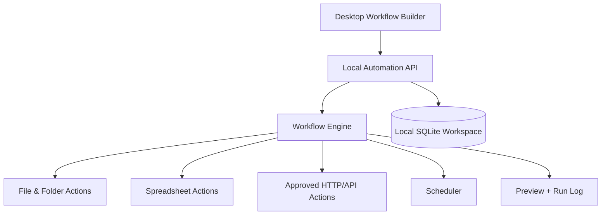

# Atulya Automation Hub

> **Create and run everyday automations from one simple workspace.** ⚡🖥️

Atulya Automation Hub is a planned standalone desktop application for building and running quick automations: move and rename files, watch folders, process spreadsheets, schedule repeatable tasks and connect approved web/API steps.

> 🚧 **Project stage:** Product blueprint and roadmap. Installers and application code are not released yet.

## ✨ What It Should Feel Like

Ask for an outcome, preview the steps, and run it:

| You want to... | Automation outcome |
|---|---|
| Rename and file downloaded invoices | A reusable watched-folder workflow |
| Move attachments into vendor folders | A reviewed sorting recipe |
| Run a spreadsheet cleanup every evening | A scheduled local job |
| Fetch approved API data into CSV | A repeatable export workflow |
| Chain file conversion and email draft creation | A visible multi-step automation |

## 🖱️ One-Click Experience

| Platform | Planned delivery |
|---|---|
| Windows | Signed `.exe` installer, desktop shortcut and local workspace |
| macOS | Signed `.dmg` application package |
| Linux | AppImage and `.deb`, plus CLI package |

First launch should include sample workflows, a visual recipe builder, a run history view, permission prompts and a backup/export option.

## 🧩 Architecture

### Design Principles

- 🔒 **Local-first:** workflows and data stay local unless the user configures a network action.
- 👀 **Preview first:** destructive, sending or external actions are shown before execution.
- 🧩 **Recipe-based:** workflows can be saved, exported and shared without hidden steps.
- 🖥️ **Cross-platform:** platform-specific actions are clearly marked.
- 🧾 **Auditable:** every run records what changed and what failed.

## 🗺️ Roadmap

| Phase | Focus | Outcome |
|---|---|---|
| 0 | Product design | Workflow format, UX mockups and security model |
| 1 | Local actions | Files, folders, CSV/Excel transformations and run logs |
| 2 | Recipe builder | Visual workflow editor, reusable templates and scheduler |
| 3 | Connectors | User-approved email drafts and HTTP/API steps |
| 4 | Distribution | One-click installers and signed release builds |

## 🛡️ Safety

Atulya Automation Hub will not bypass authentication, OTPs, CAPTCHAs, access restrictions or application security controls. Sending, deletion and remote actions must remain visible and user-approved.

## 🤝 Contributing

Open an issue describing a repetitive task you want automated, including input files, expected result and the operating system you use.

## 🔗 Independent Atulya Projects

Each Atulya repository is a separate product and does not require this application: [ERP](https://github.com/atulyaai/Atulya-Accounting-ERP) · [GST](https://github.com/atulyaai/Atulya-GST-Suite) · [SAP](https://github.com/atulyaai/Atulya-SAP-Automations) · [Office](https://github.com/atulyaai/Atulya-Office) · [HR](https://github.com/atulyaai/Atulya-HR-Suite) · [DataClean](https://github.com/atulyaai/Atulya-Data-Scruber) · [Invoice](https://github.com/atulyaai/Atulya-Invoice) · [Convert](https://github.com/atulyaai/Atulya-All-File-Converter) · [Host](https://github.com/atulyaai/Atulya-Launch)

## 📜 License

MIT is planned for the open-source core.
