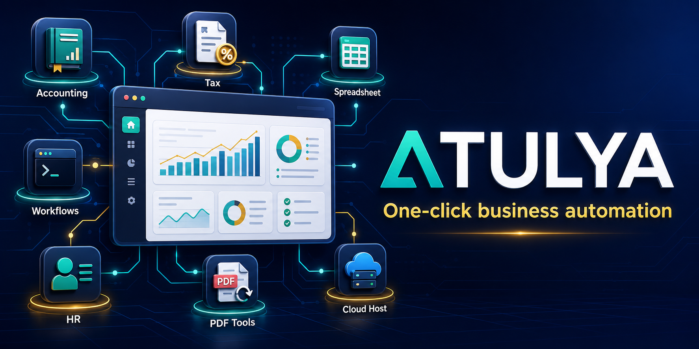
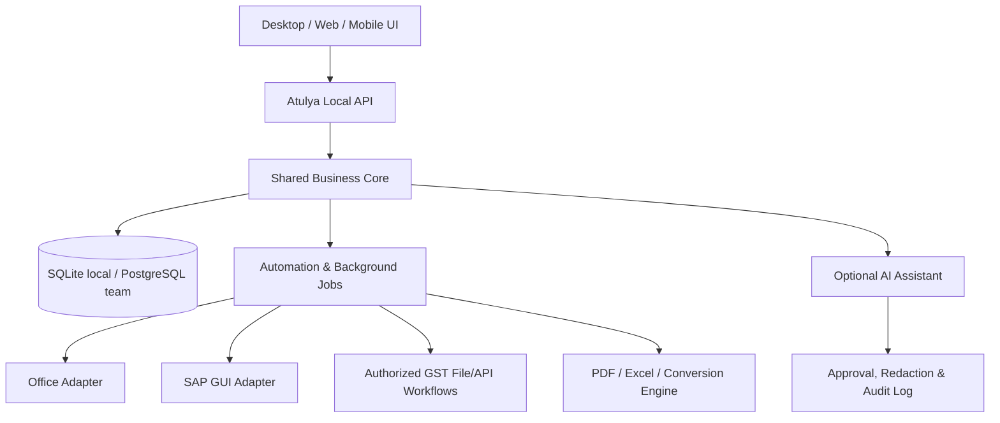

# Atulya One

> **Free business automation for India. One workspace. Your data. Your rules.** 🇮🇳

Atulya One is the planned command center for free, local-first business automation: billing, accounts, GST preparation, Office automation, SAP workflows, payroll, file conversion, and app hosting.

> 🚧 **Project stage:** Product blueprint and community roadmap. Installers and application code are not released yet.

## ✨ What Atulya Should Feel Like

Ask for a result instead of fighting files and forms:

| You want to... | Atulya module |
|---|---|
| Clean a messy SAP or bank export | [Atulya DataClean](https://github.com/atulyaai/Atulya-DataClean) |
| Create invoices, quotations and POs | [Atulya Invoice](https://github.com/atulyaai/Atulya-Invoice) |
| Prepare GST reconciliation working files | [Atulya GST](https://github.com/atulyaai/Atulya-GST) |
| Automate Excel, Word, Outlook or slides | [Atulya Office](https://github.com/atulyaai/Atulya-Office) |
| Run approved SAP GUI workflows | [Atulya SAP](https://github.com/atulyaai/Atulya-SAP) |
| Manage employees and payroll | [Atulya HR](https://github.com/atulyaai/Atulya-HR) |
| Run accounts and inventory | [Atulya ERP](https://github.com/atulyaai/Atulya-ERP) |
| Convert PDFs, scans and sheets offline | [Atulya Convert](https://github.com/atulyaai/Atulya-Convert) |
| Host Atulya apps and dashboards | [Atulya Host](https://github.com/atulyaai/Atulya-Host) |

## 🖱️ One-Click Experience

| Platform | Planned delivery |
|---|---|
| Windows | Signed `.exe` installer, desktop shortcut and automatic local database |
| macOS | Signed `.dmg` application package |
| Linux | AppImage and `.deb`, plus Docker Compose for servers |
| Web/PWA | Installable browser app connected to a user-controlled Atulya server |
| Android | Companion flows from Atulya Convert and approvals |

First launch should include a demo company, sample spreadsheets, guided setup, backup location selection, and optional module installation.

## 🧩 Architecture

### Architecture Principles

- 🔒 **Local-first:** business files remain on the user's computer unless they explicitly configure sync.
- 🔌 **Modular:** each module works independently before being connected in Atulya One.
- 📂 **Portable data:** Excel, CSV, JSON and PDF exports are first-class outputs.
- ✅ **Human approval:** government filings, payments, emails and ERP postings require confirmation.
- 🧾 **Auditable:** changes and automation actions should leave reviewable logs.

## 🗺️ Roadmap

| Phase | Focus | Outcome |
|---|---|---|
| 0 | Architecture and UX | Designs, schemas, packaging plan and sample workflows |
| 1 | Office + DataClean + Invoice | Useful standalone one-click desktop tools |
| 2 | GST + HR + SAP | India and enterprise workflow modules with validation |
| 3 | ERP foundation | Shared customers, ledgers, inventory and reporting |
| 4 | Atulya One dashboard | Install modules and run connected workflows |
| 5 | Host + mobile companion | Self-hosting and mobile document utilities |

## 🛡️ Safety and Compliance

Atulya will prepare, validate and organize business data. It will not bypass CAPTCHAs, OTPs, MFA, portal access restrictions, employer authorization or SAP security settings. Government and regulated submissions must use permitted file formats or authorized integrations with user approval.

## 🤝 Contributing

We welcome product flows, UX mockups, sample anonymous spreadsheets, transaction recipes, installer research and code contributions. Open an issue describing the task you want Atulya to automate.

## 📜 License

MIT is planned for the open-source core unless a module requires a different compatible notice.
